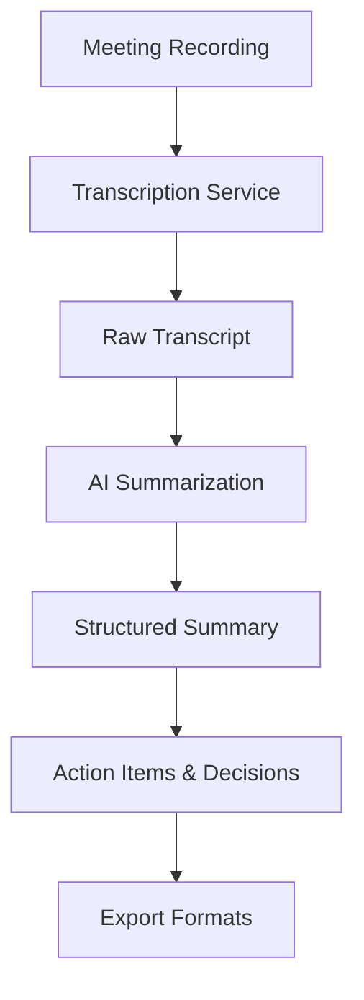

# TLDR Architecture Overview

## System Design Principles

TLDR is designed following modern software architecture principles:

### Core Principles

1. **Modular Architecture**: Organized by domain functionality rather than technical layers
2. **Async-First**: Built for high-performance I/O operations
3. **Production-Ready**: Security, monitoring, and scalability from day one
4. **API-Centric**: RESTful API design with comprehensive documentation
5. **Test-Driven**: 80%+ test coverage with comprehensive test strategies

### Technology Stack

#### Backend Framework
- **FastAPI**: Modern, high-performance web framework
- **Python 3.11+**: Latest Python with performance improvements
- **Pydantic**: Data validation and settings management
- **Uvicorn**: ASGI server for production deployment

#### AI/ML Services
- **OpenAI GPT-4**: Primary LLM for summarization
- **AssemblyAI**: Transcription service with superior accuracy
- **LangChain**: AI orchestration and prompt management

#### Data & Storage
- **PostgreSQL**: Primary database for structured data
- **SQLAlchemy**: ORM with async support
- **Redis**: Caching and session storage

#### DevOps & Quality
- **Docker**: Containerization for consistent deployment
- **Kubernetes**: Container orchestration for scalability
- **GitHub Actions**: CI/CD pipeline
- **Ruff + Black + MyPy**: Code quality and type safety

## Module Architecture

### Domain-Driven Design

```
src/
├── transcription/      # Audio-to-text conversion
├── summarization/      # AI-powered content analysis
├── integrations/       # External service connections
├── api/               # Web API layer
├── core/              # Shared utilities and configuration
└── models/            # Data models and schemas
```

### Key Architectural Decisions

1. **Module over Layer**: Organized by business domain, not technical layers
2. **AssemblyAI over Whisper**: Better accuracy and speaker diarization
3. **FastAPI over Django/Flask**: Superior async performance and auto-documentation
4. **PostgreSQL over NoSQL**: Structured data with complex relationships

## Data Flow



## Integration Points

### External Services
- **Microsoft Teams**: Meeting transcript and recording access
- **Zoom**: API integration for meeting data
- **Google Meet**: Webhook-based integration
- **Slack/Discord**: Summary distribution

### Security Architecture
- **JWT Authentication**: Secure API access
- **Role-Based Access**: Granular permission control
- **Data Encryption**: At-rest and in-transit
- **Audit Logging**: Comprehensive activity tracking

## Scalability Considerations

### Performance Targets
- **Processing Time**: < 2 minutes for 1-hour meeting
- **Concurrent Users**: 100+ simultaneous requests
- **Availability**: 99.9% uptime SLA
- **Response Time**: < 200ms for API endpoints

### Scaling Strategy
- **Horizontal Scaling**: Kubernetes-based auto-scaling
- **Caching**: Redis for frequently accessed data
- **CDN**: Static asset delivery optimization
- **Database Optimization**: Connection pooling and query optimization

## Architecture Decision Records

- [ADR-001: Technology Stack Selection](decisions/001-tech-stack.md)
- [ADR-002: Transcription Service Choice](decisions/002-transcription-service.md)
- [ADR-003: Database Schema Design](decisions/003-database-schema.md)

## Next Steps

1. Review individual [Architecture Decision Records](decisions/)
2. Explore [system diagrams](diagrams/)
3. Check [API documentation](../api/)
4. Read the [implementation plan](../planning/implementation-plan.md)